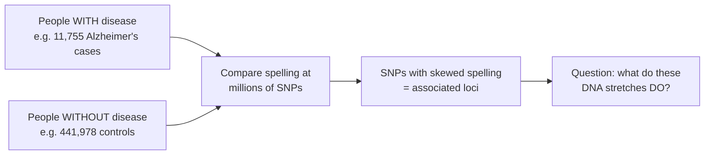
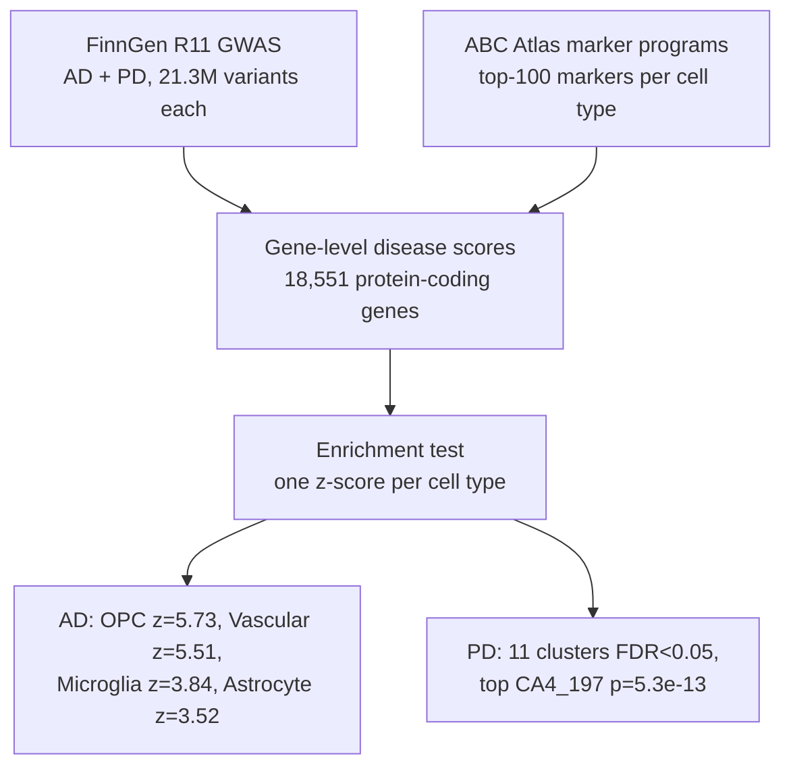
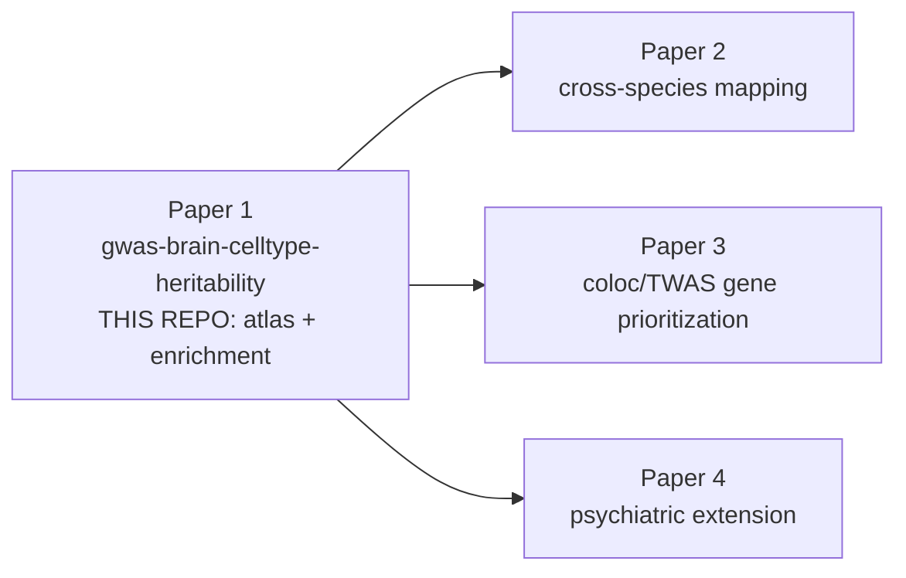

# Extended Introduction: From DNA Spelling to Brain Cell Types

*A gentle, no-prerequisites walkthrough of what this project does and why. Every technical idea is first shown on a tiny made-up example you can check by hand — no statistics or genetics background needed.*

> **Series note:** This is **Paper 1 of 4** in the GWAS × brain cell-type series. Papers 2 (cross-species mapping), 3 (coloc/TWAS prioritization), and 4 (psychiatric extension) all reuse the harmonized GWAS inputs and cell-type gene programs built here [INTRODUCTION.md](INTRODUCTION.md).

*Concept figure: GWAS results and cell-type marker lists are combined into gene-level disease scores, then each cell type is tested for enrichment. (Mermaid-renderable version: [figures/concept_figure.md](figures/concept_figure.md).)*

---

## DNA: a very long instruction book

Every cell in your body carries the same instruction book: your DNA — a string of about 3 billion letters written with just four characters, A, C, G, and T. The book is nearly identical in every human on Earth. But "nearly" is doing a lot of work: at millions of positions, different people carry different letters.

The most common difference is a **single-letter swap**, called a **single nucleotide polymorphism**, or **SNP** (pronounced "snip"). At one particular position, most people might carry an A, while a minority carry a G. Since you inherit one copy from each parent, your personal state at that position can be written as a count: **0, 1, or 2** copies of the rarer letter. That simple count is all the "genotype" data we will need below.

## What a GWAS does: a six-person example

A **genome-wide association study (GWAS)** is a giant comparison exercise. Before the giant version, here is the whole idea on six made-up people. We measure one SNP (genotype 0/1/2) and one trait (say, a memory score):

| Person | Genotype (copies of G) | Memory score |
|---|---|---|
| 1 | 0 | 50 |
| 2 | 0 | 52 |
| 3 | 1 | 55 |
| 4 | 1 | 57 |
| 5 | 2 | 61 |
| 6 | 2 | 63 |

Look at the pattern: each extra copy of G comes with a higher score — averages of 51, 56, and 62 for genotypes 0, 1, and 2. That steady climb is an **association**. The procedure is literally: *group people by genotype, compare the averages, and ask whether the slope you see is bigger than what luck would produce.* A GWAS is this same check repeated at millions of SNP positions, with millions of people, and with disease status (with/without Alzheimer's) in place of the memory score.

Two shorthand words you will see, now that you have done the procedure by hand:

- **Effect size ("beta")**: the slope itself — in the toy example, about +5.5 points per extra G copy. Just the answer to "how much does the trait change per copy?"
- **z-score**: the slope divided by how wobbly that slope estimate is. In the toy example, 6 people is too few to trust the pattern; with 500,000 people the same slope would be rock solid. Dividing "how big" by "how shaky" gives one number that says *how surprised we should be*. A z-score of 0 means "nothing going on"; a z-score near ±2 is borderline; beyond ±5 is the kind of surprise GWAS call genome-wide significant.

In this project, the GWAS data come from **FinnGen Release 11** — roughly 21 million tested variants for Alzheimer's disease (AD) and Parkinson's disease (PD) each (see [DATA_SOURCES.md](DATA_SOURCES.md)).

## The plot twist: most clues point at dimmer switches, not light bulbs

Only about 1–2% of your DNA encodes proteins — the molecular machines of the cell. Much of the rest is **regulatory DNA**: switches and dials that control *when*, *where*, and *how strongly* each gene is turned on.

Think of a gene as a light bulb. The protein-coding part is the bulb; the regulatory DNA around it is the **dimmer switch**. Crucially, *every cell carries the same bulbs, but each cell type sets its dimmers differently.* A neuron cranks up genes for electrical signaling; a microglial cell cranks up genes for immune defense.

Most disease-associated SNPs land in the non-coding, dimmer-switch regions [14]. They probably do not break a protein — they nudge a dimmer, slightly changing how much of a gene is made, *in a specific cell type*. That is why the central question of this paper is: **which cell type's dimmer switches carry the disease risk?** [INTRODUCTION.md](INTRODUCTION.md)

## Meet the brain's cell types

Your brain is an orchestra of many cell types that must play together. The [Allen Brain Cell (ABC) Atlas](https://portal.brain-map.org/atlases-and-data/bkp/abc-atlas) profiled ~3.3 million individual brain-cell nuclei and defined a taxonomy of 31 "superclusters" and 461 "clusters" (and >3,000 fine types) [5]. The main sections:

- **Neurons** — the signaling cells: excitatory ("go!"), inhibitory ("calm down"), dopamine-producing midbrain neurons (the ones lost in Parkinson's), and hundreds more.
- **Microglia** — the brain's resident **immune cells**: its sanitation-and-emergency crews.
- **Astrocytes** — star-shaped support cells: the road crew and power grid.
- **Oligodendrocytes and OPCs** — oligodendrocytes wrap neuronal wires in insulation (myelin); **OPCs** are their stem-cell-like parents.
- **Vascular cells** — blood vessels and the blood–brain barrier.

Each cell type has its own set of "turned-up" genes — its **marker genes**. Those lists are the cell type's signature, and they are exactly what we test.

## Heritability, from a toy example to a definition

Imagine 8 people again, but now suppose their memory scores track their genotypes *perfectly* — knowing someone's DNA spelling tells you their exact score. Then we would say the trait's variation in this little group is fully explained by DNA. Now the opposite: scores are all over the place and genotypes look random relative to them — DNA explains nothing. Real traits sit in between.

**Heritability** is simply that in-between number, between 0 and 1: *the fraction of the differences between people that lines up with DNA spelling differences rather than environment and chance.* It does not mean a disease is destiny — most brain diseases are influenced by thousands of variants, each nudging risk by a tiny amount.

Here is the leap this project makes: we ask not just *how much* heritability there is, but ***where* it lives**. If disease-associated spellings cluster near microglia's marker genes more than near, say, cerebellar neurons' marker genes, then microglia are a prime suspect [1,2]. The formal version of that statement — regressing GWAS signal on genomic annotations to partition heritability — is S-LDSC [1]; the gene-level version is MAGMA [3]; the enhancer-linked version is sc-linker [4]. All three are different packaging of the same question you just asked.

## The enrichment test, on ten toy genes

The core test of this paper fits in one small table. Suppose we have computed a disease score for 10 genes (bigger = more disease association; real scores come from averaging squared z-scores of the SNPs in each gene — the chi-square statistic in [METHODS.md](METHODS.md)):

| Gene | Disease score | Microglia marker? |
|---|---|---|
| A | 9.1 | yes |
| B | 8.7 | yes |
| C | 7.9 | yes |
| D | 6.2 | no |
| E | 5.8 | no |
| F | 5.1 | no |
| G | 4.9 | no |
| H | 4.4 | no |
| I | 4.0 | no |
| J | 3.6 | no |

The microglia markers sit at the top: average 8.6 versus 4.7 for the rest. **Enrichment** is exactly this observation — "the marker genes carry unusually high disease scores" — scaled by how surprising it is given the spread of the scores. That scaled surprise is the **enrichment z-score** reported throughout our results. (In the real analysis the "yes/no" column comes from the top-100 ranked marker genes of each cell type, and the comparison is run as a regression so other explanations can be adjusted away [2,3].)

One more piece of honesty machinery. If we test 436 cell types, then even if *nothing* is truly enriched, a few will look impressive by pure luck — like flipping 436 coins and being amazed at the one that landed heads 8 times in a row. The **FDR q-value** (Benjamini–Hochberg) fixes this by estimating, among the cell types we call significant, what fraction are probably luck. "FDR < 0.05" means: at most about 5% of the names on this list are expected to be false alarms.

## The pipeline, end to end

1. **Cell-type gene programs.** Top-100 marker genes per cell type, at three resolutions: class (Neuronal vs. Non-neuronal), supercluster (30 groups), and cluster (436 fine types) [DATA_SOURCES.md](DATA_SOURCES.md).
2. **Gene-level disease scores.** Each SNP is assigned to nearby genes; each gene gets a score for how strongly its neighborhood is disease-associated — a simplified version of MAGMA [3] (see [METHODS.md](METHODS.md)).
3. **The enrichment test.** For every cell type: *do its marker genes carry unusually high disease scores?* — the toy-table procedure above, run at scale, yielding one z-score per cell type.

### What we found (so far)

- **Alzheimer's disease:** at the supercluster level, four cell types pass significance — **OPC z = 5.73; Vascular z = 5.51; Microglia z = 3.84; Astrocyte z = 3.52**. In words: AD risk spelling concentrates near the dimmer switches of glial and vascular support cells, not neurons. At the fine cluster level, 9 clusters are significant (top: `Mgl_9`, a microglial cluster, p ≈ 2.2e-21).
- **Parkinson's disease:** nothing survives at coarse levels (0 of 30 superclusters) — but at the fine cluster level, **11 clusters pass FDR < 0.05**, topped by `CA4_197` (a hippocampal CA4 cluster, p = 5.3e-13). That is a **resolution gain of 0 → 11**: the fine-grained atlas found signal that coarse labels completely blur [resolution_gain.csv](../reports/resolution_gain.csv).

That last point is the thesis of the whole series: better cell-type maps = sharper genetic answers [6,7].

## The four-paper series

Paper 1 (this repo) builds the shared inputs — harmonized GWAS and cell-type gene programs — that Papers 2–4 consume directly.

## The math, in one sentence each (with links to learn more)

Every quantity below was already built by hand above; here are its name and where to go deeper:

- **Chi-square gene statistic** — the disease score per gene: the average of squared z-scores of the SNPs inside it; bigger means "spelling near this gene is more disease-skewed than chance predicts." Background: [StatQuest: Chi-square test](https://www.youtube.com/watch?v=7_cs1YlZoug), [Khan Academy: Chi-square](https://www.khanacademy.org/math/statistics-probability/inference-categorical-data-chi-square-tests).
- **Enrichment z-score** — the toy-table comparison ("markers vs. the rest") scaled by how shaky it is; counts how many standard deviations above zero the enrichment sits. Background: [StatQuest: p-values and z-scores](https://www.youtube.com/watch?v=JQc3yx0-Q9E), [Seeing Theory](https://seeing-theory.brown.edu/) (interactive).
- **FDR q-value** — the coin-flipping guardrail: the expected fraction of false discoveries among the hits at each threshold. Background: [StatQuest: FDR and Benjamini-Hochberg](https://www.youtube.com/watch?v=K8LQSvtjcEo), [3Blue1Brown](https://www.3blue1brown.com/) for probability intuition generally.

## One honest caveat

Enrichment is a **statistical association, not proof of causation** [INTRODUCTION.md — Scope and boundary](INTRODUCTION.md). A cell type lighting up means its regulatory DNA disproportionately carries risk variants — a strong hint about where the disease mechanism lives, and a prioritized map for the follow-ups in Papers 2–4. Also, our GWAS data are European-ancestry-heavy (FinnGen is Finnish), so conclusions about other ancestries need dedicated data.

## Where to go next

- [METHODS.md](METHODS.md) — the how, including what's done vs. intended, and a newcomer's guide to the statistics.
- [INTRODUCTION.md](INTRODUCTION.md) — the academic framing with full citations (reference numbers [1]–[14] above point there).
- [DATA_SOURCES.md](DATA_SOURCES.md) — exact files, checksums, and accession numbers.
- [ANALYSIS_PLAN.md](ANALYSIS_PLAN.md) — what is real vs. pending.
