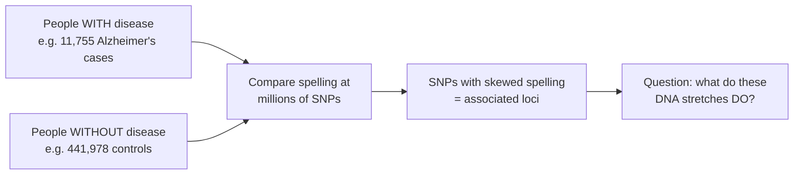
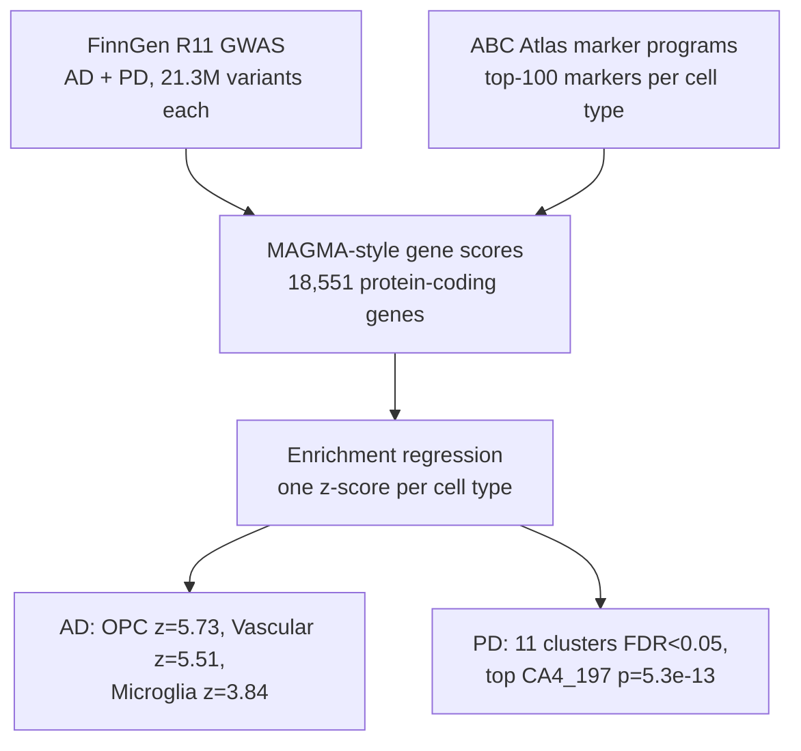
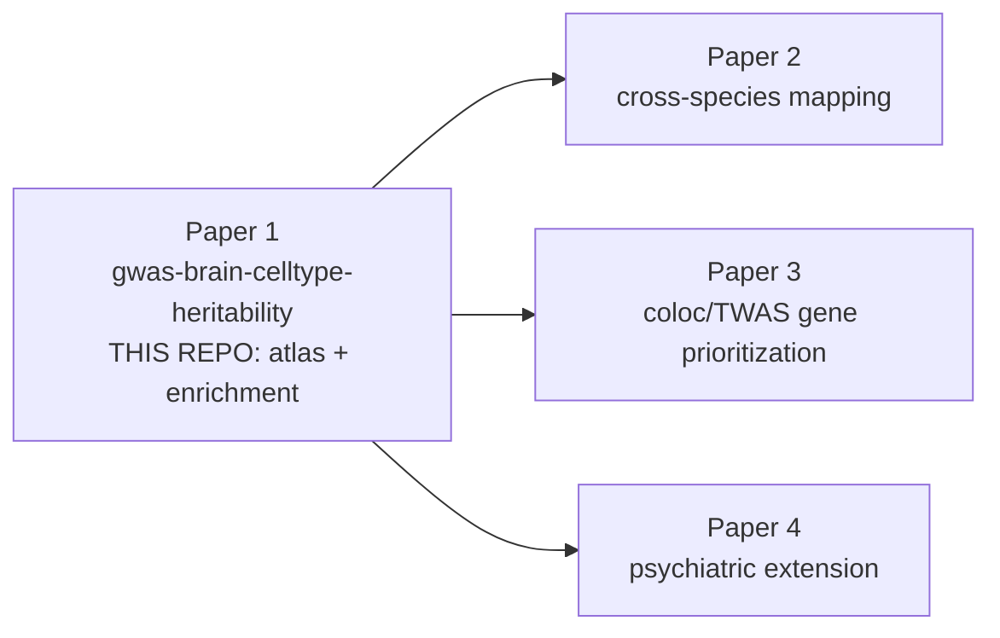

# Extended Introduction: From DNA Spelling to Brain Cell Types

*A gentle, no-prerequisites walkthrough of what this project does and why. If you have never taken a biology class, this page is for you.*

> **Series note:** This is **Paper 1 of 4** in the GWAS × brain cell-type series. Papers 2 (cross-species mapping), 3 (coloc/TWAS prioritization), and 4 (psychiatric extension) all reuse the harmonized GWAS inputs and cell-type gene programs built here [INTRODUCTION.md](INTRODUCTION.md).

---

## DNA: a very long instruction book

Every cell in your body carries the same instruction book: your DNA. Think of it as a string of about 3 billion letters, written with just four characters — A, C, G, and T. This book is nearly identical in every human on Earth. But "nearly" is doing a lot of work: at millions of positions, different people carry different letters.

One of the most common kinds of difference is a **single-letter swap**, called a **single nucleotide polymorphism**, or **SNP** (pronounced "snip"). At one particular position, most people might carry an A, while a minority carry a G. None of this is unusual — SNPs are the ordinary spelling variants that make each genome unique.

## What a GWAS does, in plain terms

A **genome-wide association study (GWAS)** is a giant comparison exercise:

1. Recruit two groups of people — for example, people with Alzheimer's disease and people without it.
2. Read the spelling at millions of SNP positions in every person.
3. At each position, ask: *is one spelling more common in the disease group than you'd expect by chance?*

If a particular letter keeps showing up more often in people with the disease, that SNP is "associated" with the disease. It is a statistical clue — a signpost pointing to a stretch of DNA that seems to matter for the disease.

In this project, the GWAS data come from **FinnGen Release 11** — roughly 21 million tested variants for Alzheimer's disease (AD) and Parkinson's disease (PD) each (see [DATA_SOURCES.md](DATA_SOURCES.md)).

## The plot twist: most clues point at dimmer switches, not light bulbs

Here is the surprise that launched a thousand follow-up studies. Only about 1–2% of your DNA encodes proteins — the actual molecular machines of the cell. The rest was once dismissed as "junk," but we now know much of it is **regulatory DNA**: switches and dials that control *when*, *where*, and *how strongly* each gene is turned on.

Think of a gene as a light bulb. The protein-coding part is the bulb itself. The regulatory DNA around it is the **dimmer switch**. And here is the crucial part: *every cell carries the same bulbs, but each cell type sets its dimmers differently.* A neuron cranks up the genes for electrical signaling; a microglial cell cranks up the genes for immune defense.

Most disease-associated SNPs land in these non-coding regions [14]. That means they probably don't break a protein outright — they nudge a dimmer, slightly changing how much of a gene is made, *in a specific cell type*. This is why the cell-type question is the central question of statistical genetics: **which cell type's dimmer switches carry the disease risk?** [INTRODUCTION.md](INTRODUCTION.md)

## Meet the brain's cell types

Your brain is not one kind of cell — it is more like an orchestra, with many instrument sections that must play together. The [Allen Brain Cell (ABC) Atlas](https://portal.brain-map.org/atlases-and-data/bkp/abc-atlas) recently profiled ~3.3 million individual brain-cell nuclei and defined a taxonomy of 31 "superclusters" and 461 "clusters" (and >3,000 fine types) [5]. The main sections:

- **Neurons** — the signaling cells. They come in many flavors: excitatory neurons that shout "go!", inhibitory neurons that say "calm down," dopamine-producing neurons of the midbrain (the ones lost in Parkinson's), and hundreds more.
- **Microglia** — the brain's resident **immune cells**. They patrol for damage, eat debris, and respond to injury. If the brain were a city, microglia would be its sanitation-and-emergency crews.
- **Astrocytes** — star-shaped support cells that feed neurons, recycle neurotransmitters, and maintain the chemical environment. The road-crew and power-grid of the brain.
- **Oligodendrocytes and OPCs** — oligodendrocytes wrap neuronal wires in insulation (myelin) so signals travel fast; **OPCs (oligodendrocyte precursor cells)** are their stem-cell-like parents, on standby to make more.
- **Vascular cells** — the cells of blood vessels and the blood–brain barrier.

Each of these cell types has its own characteristic set of "turned-up" genes — its **marker genes**. Those marker lists are the cell type's signature, and they are exactly what we use to ask our question.

## Heritability: how much of the risk is in the spelling?

**Heritability** is a number between 0 and 1 that answers: *among a population, how much of the variation in disease risk is explained by DNA spelling differences (as opposed to environment and chance)?* It does not mean a disease is destiny — most brain diseases are influenced by thousands of variants, each nudging risk by a tiny amount.

Here's the leap this project makes: we can ask not just *how much* heritability there is, but ***where* it lives**. If disease-associated spelling variants cluster near the marker genes of microglia more than near the marker genes of, say, cerebellar neurons, then microglia are a prime suspect in how the disease unfolds [1,2].

## The pipeline, end to end

1. **Cell-type gene programs.** From the ABC Atlas we take the top-100 ranked marker genes for each cell type, at three levels of resolution: class (e.g. Neuronal vs. Non-neuronal), supercluster (30 groups), and cluster (436 fine types) [DATA_SOURCES.md](DATA_SOURCES.md).
2. **Gene-level disease scores.** Each SNP is assigned to nearby genes, and each gene gets a score for how strongly its neighborhood is associated with the disease — a simplified version of the MAGMA method [3] (see [METHODS.md](METHODS.md)).
3. **The enrichment test.** For every cell type, we ask: *do this cell type's marker genes carry unusually high disease scores?* The answer is a z-score per cell type — big positive numbers mean enrichment.

### What we found (so far)

- **Alzheimer's disease:** at the supercluster level, four cell types pass statistical significance — **Oligodendrocyte precursor (OPC), z = 5.73; Vascular, z = 5.51; Microglia, z = 3.84; Astrocyte, z = 3.52**. In words: AD risk spelling concentrates near the dimmer switches of glial and vascular support cells, not neurons themselves. At the fine cluster level, 9 clusters are significant (top: `Mgl_9`, a microglial cluster, p ≈ 2.2e-21).
- **Parkinson's disease:** nothing survives significance testing at the coarse levels (0 of 30 superclusters) — but at the fine cluster level, **11 clusters pass FDR < 0.05**, topped by `CA4_197` (a hippocampal CA4 cluster, p = 5.3e-13). That is a **resolution gain of 0 → 11**: the fine-grained atlas found signal that coarse labels completely blur [resolution_gain.csv](../reports/resolution_gain.csv).

That last point is the thesis of the whole series: better cell-type maps = sharper genetic answers [6,7].

## The four-paper series

Paper 1 (this repo) builds the shared inputs — harmonized GWAS and cell-type gene programs — that Papers 2–4 consume directly.

## The math, in one sentence each (with links to learn more)

We won't re-teach statistics here — free resources do it beautifully — but here is what each quantity in our results means:

- **Chi-square gene statistic** — each gene gets a score equal to the average of squared z-statistics of the SNPs inside it; bigger means "the spelling near this gene is more disease-skewed than chance predicts." Background: [StatQuest: Chi-square test](https://www.youtube.com/watch?v=7_cs1YlZoug), [Khan Academy: Chi-square](https://www.khanacademy.org/math/statistics-probability/inference-categorical-data-chi-square-tests).
- **Enrichment z-score** — the regression coefficient for "is this gene a marker of cell type X?", divided by its standard error; it counts how many standard deviations above zero the enrichment is. Background: [StatQuest: p-values and z-scores](https://www.youtube.com/watch?v=JQc3yx0-Q9E), [Seeing Theory](https://seeing-theory.brown.edu/) (interactive).
- **FDR q-value** — when you test 436 cell types, some will look significant by luck; the q-value (Benjamini–Hochberg) estimates the expected fraction of false discoveries among the hits at each threshold. Background: [StatQuest: FDR and Benjamini-Hochberg](https://www.youtube.com/watch?v=K8LQSvtjcEo), [3Blue1Brown](https://www.3blue1brown.com/) for building probability intuition generally.

## One honest caveat

Enrichment is a **statistical association, not proof of causation** [INTRODUCTION.md — Scope and boundary](INTRODUCTION.md). A cell type lighting up means its regulatory DNA disproportionately carries risk variants — a strong hint about where the disease mechanism lives, and a prioritized map for the experimental follow-ups that Papers 2–4 pursue. Also, our GWAS data are European-ancestry-heavy (FinnGen is Finnish), so conclusions about other ancestries need dedicated data.

## Where to go next

- [METHODS.md](METHODS.md) — the how, including what's done vs. intended, and a newcomer's guide to the statistics.
- [INTRODUCTION.md](INTRODUCTION.md) — the academic framing with full citations (reference numbers [1]–[14] above point there).
- [DATA_SOURCES.md](DATA_SOURCES.md) — exact files, checksums, and accession numbers.
- [ANALYSIS_PLAN.md](ANALYSIS_PLAN.md) — what is real vs. pending.
