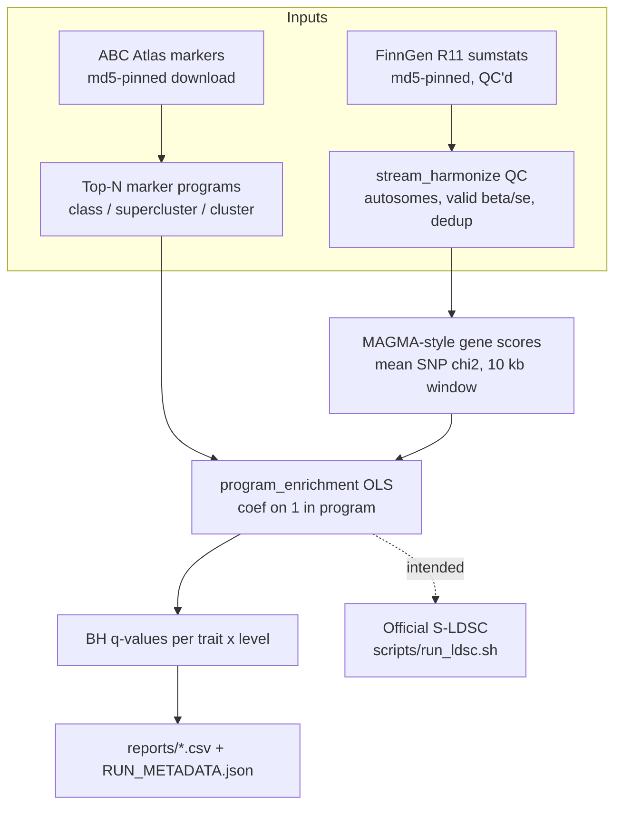
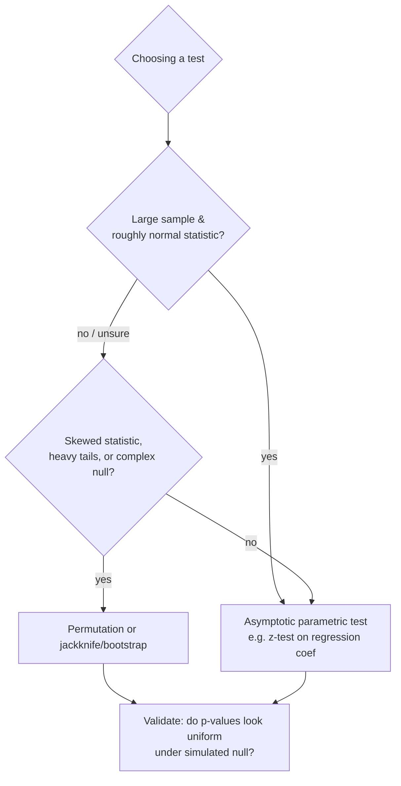

# Methods: What's Done, What's Intended, and Why

*Written for new contributors, including those new to data science. Code pointers are to `src/celltype_heritability/`; results live in `reports/`.*

## Done vs. Intended

This project deliberately separates **what has actually been run and committed** from **what is scripted but pending**. When in doubt, trust [ANALYSIS_PLAN.md](ANALYSIS_PLAN.md) and `reports/RUN_METADATA.json`.

### Done (real, reproducible, committed)

| Component | What exists | Where |
|---|---|---|
| Cell-type marker programs | ABC Atlas (Siletti 2023 WHB) top-100 ranked markers per node, protein-coding only, at class / supercluster / cluster levels, with md5-pinned inputs | `reports/gene_programs/`, `atlas.py` |
| GWAS staging | FinnGen R11 AD (`G6_ALZHEIMER`, 11,755 cases / 441,978 controls) and PD (`G6_PARKINSON`, 5,150 cases / 448,583 controls); 21,306,794 variants → 18,565,791 / 18,565,809 after deterministic QC; md5 pinned | `sumstats.stream_harmonize`, [DATA_SOURCES.md](DATA_SOURCES.md) |
| Gene annotation | Ensembl GRCh38 BioMart table, longest span per symbol, 18,551 protein-coding autosomal genes | `sumstats.load_gene_annotation` |
| Gene-level scores | MAGMA-style SNP-wise mean model: SNPs mapped to genes ±10 kb, mean SNP chi-square per gene (no LD) | `magma.map_snps_to_genes`, `magma.gene_test_statistics` |
| Enrichment testing | Per-program OLS regression `gene_stat ~ 1 + log(n_snps) + 1[in program]`; coefficient z-score, two-sided normal p, Benjamini–Hochberg q | `magma.program_enrichment`, `magma.bh_fdr` |
| AD + PD results | AD supercluster: **OPC z=5.73, Vascular z=5.51, Microglia z=3.84, Astrocyte z=3.52** (4 FDR<0.05 of 30); AD cluster: 9 FDR<0.05 of 436 (top `Mgl_9`); PD cluster: **11 FDR<0.05** (top `CA4_197`, p=5.3e-13); PD supercluster: 0 — resolution gain 0→11 | `reports/magma_enrichment_*.csv`, `reports/resolution_gain.csv` |
| Robustness | Top-100 vs top-200 marker sensitivity: Spearman ρ = 0.81 (AD), 0.86 (PD) on program z-scores | `reports/concordance_topn_sensitivity.csv` |
| Tests | 15 synthetic-data tests; planted enrichment recovered by both S-LDSC and MAGMA paths | `tests/` (`python -m pytest -q`) |

### Intended (scripted or scoped, not yet run)

| Component | Status |
|---|---|
| Official S-LDSC with the 1000 Genomes Phase 3 EUR LD panel and baseline-LD v2.2 model | `scripts/run_ldsc.sh` ready; LD reference not staged in this sandbox ([DATA_SOURCES.md](DATA_SOURCES.md)) |
| sc-linker enhancer-gene-linked disease programs | `sclinker.py` is a deterministic skeleton; production run pending |
| EBI GWAS Catalog staging (Bellenguez 2022 AD, GCST90027158; Nalls 2019 PD, GCST009325) | Registered in `sumstats.GWAS_SOURCES` with resumable downloaders and official md5s; EBI FTP throttled to ~40 KB/s here, so not staged |
| Manuscript/writeup | tracked in open issue [#2](https://github.com/hwilner/gwas-brain-celltype-heritability/issues/2); see all [open issues](https://github.com/hwilner/gwas-brain-celltype-heritability/issues) |



## Design decisions, and why

### Why top-N marker genes?

A cell type's "program" must be a compact, concrete gene set. We use the ABC Atlas's published MapMyCells query-marker ranking and take the **top 100 ranked markers per node**, protein-coding only. Rationale: (1) marker rankings reward *specificity*, which is what an enrichment test needs — ubiquitously expressed genes carry no cell-type information; (2) a fixed N keeps every program the same size, so no cell type wins just by having a bigger gene set; (3) the cutoff is arbitrary, so we **test the arbitrariness**: the top-100 vs top-200 sensitivity analysis gives Spearman ρ = 0.81/0.86 on program z-scores — rankings are stable, not a knife-edge artifact.

### Why FinnGen instead of the EBI GWAS Catalog files?

The planned GWAS (Bellenguez 2022 AD; Nalls 2019 PD) are registered with resumable downloaders and official checksums, but EBI FTP throughput in this environment (~40 KB/s) made 0.5–0.8 GB transfers impractical. **FinnGen R11 is a legitimate substitute**: it is a large, well-QC'd, open biobank GWAS with the same disease endpoints (ICD-coded Alzheimer's and Parkinson's), on GRCh38, with ~21M variants per trait. **Caveat:** FinnGen is Finnish — a bottlenecked European population. Trait definitions overlap but are not identical to the meta-analyses, and effect sizes/portability across ancestries will differ. The pipeline is data-agnostic: point `scripts/run_magma_enrichment.py` at the EBI files once staged and the atlas reproduces against the larger GWAS.

### Why MAGMA-style gene-level first, S-LDSC second?

S-LDSC is the field standard for partitioned heritability, but it needs an external LD reference panel (1000 Genomes EUR, ~GBs) and the official `ldsc` toolchain. The MAGMA-style path needs only summary statistics and a gene table — everything streamable in-repo — so it unblocks real results early and provides 15-test synthetic validation of the statistics. The in-repo `sldsc.py` implements the core weighted regression with block-jackknife SEs and is validated on synthetic data with planted enrichment; the official run with the baseline-LD model is the intended confirmatory step (`scripts/run_ldsc.sh`). Two methods with different assumptions agreeing is much stronger evidence than either alone.

### Why FDR at 0.05?

We test up to 436 programs per trait at the cluster level. Raw p < 0.05 would yield ~22 false positives by chance. Benjamini–Hochberg FDR at 0.05 says: among the reported hits, ~5% are expected false — a sensible trade for a discovery-stage atlas (vs. Bonferroni, which is so conservative it would erase the PD cluster signal entirely; we still report Bonferroni-style checks across the hierarchy as a sensitivity).

### Why z-scores with jackknife?

Every reported effect is coefficient / standard error = a **z-score**, interpreted against the standard normal. For S-LDSC, analytical SEs are unreliable because neighboring SNPs are correlated (LD), so the standard fix is the **block jackknife**: re-fit the regression 50 times, each time deleting one contiguous block of the genome, and measure how much the estimate wiggles. This needs no distributional assumption about the SNPs — only that blocks are roughly independent.

## Statistics for newcomers

### p-values vs q-values and multiple testing

A **p-value** answers: *if nothing were going on, how often would I see a result this extreme?* Test one cell type and p = 0.001 is impressive; test 436 and you *expect* several that small by luck. That is **multiple testing**. A **q-value** is the FDR-adjusted p-value: q = 0.05 means ~5% of calls at that threshold are false. Rule of thumb: report p, decide with q.

### Enrichment ≠ causation

A significant enrichment means disease signal *concentrates* in a cell type's markers. It does not prove that cell type causes the disease — correlated gene sets, LD, and pleiotropy can masquerade. Enrichment is a prioritization map, not a verdict; orthogonal evidence must come from follow-up analyses.

### Parametric vs non-parametric: a decision guide

**Parametric tests** assume a specific distribution (usually the normal) and get p-values from math about that distribution — fast, and valid when assumptions hold. **Non-parametric / resampling tests** (permutation, jackknife, bootstrap) make weaker assumptions by re-computing the statistic on shuffled or resampled data — slower, but robust when distributions are weird.



Where this lands in our codebase:

- **MAGMA-style enrichment (done):** OLS coefficient z-test with normal-theory SEs. Gene chi-square statistics are right-skewed (many small, few huge), so the asymptotic SE may be overconfident. With 18,506 genes per test the central limit theorem helps, but **an open consideration is a gene-label permutation calibration**: shuffle program membership, recompute, and check that null p-values are uniform. Until that's run, treat borderline q-values with humility.
- **S-LDSC (skeleton):** block jackknife SEs — the non-parametric choice, standard in the field precisely because LD violates independence assumptions.
- **How to choose, generally:** if you can cheaply simulate the null (we can — `simulate.py` plants known enrichment), *always* check that your test's p-values are uniform on null data. A test that fails its own calibration is wrong regardless of how principled it looks.

## Data-science hygiene concepts used here

### Data versioning and checksums

Code has git; data needs its own versioning. Every external input is pinned by an **md5 checksum** recorded in [DATA_SOURCES.md](DATA_SOURCES.md) and echoed into `reports/RUN_METADATA.json`. If a download is corrupted or a provider silently updates a file, the checksum mismatch fails loudly instead of poisoning results silently. Rule: *if it's an input and it doesn't have a checksum, it isn't staged.*

### Reproducible seeds

All simulation and any stochastic step uses explicit seeds (`simulate.py`); tests assert exact recovery of planted effects. Deterministic QC (`stream_harmonize`: autosomes 1–22, 0 < p ≤ 1, non-missing beta/se with se > 0, ACGT alleles, dedup by (chrom, pos)) means the same input file always yields the same output file — byte counts are in `RUN_METADATA.json` so you can verify.

### Reference-genome builds (GRCh38!)

Genomic coordinates are meaningless without a **reference build**. Position 100,000 on chromosome 7 in GRCh37 (hg19) is *a different physical location* than in GRCh38. Mixing builds silently mis-maps SNPs to genes and ruins every downstream number. Our stack is **GRCh38 end-to-end**: FinnGen R11 sumstats, Ensembl GRCh38 gene table, ABC Atlas GRCh38 annotations. If you bring in a GRCh37 resource, lift it over first — and document it.

### Ancestry bias in GWAS

Most GWAS (FinnGen included) are overwhelmingly European-ancestry. Effect sizes, allele frequencies, and LD patterns differ across populations, so enrichments estimated here may not transfer to non-European populations. We flag this as a scope boundary, not an afterthought: any cross-ancestry claim requires non-European GWAS and matched LD references.

## Reproduce the headline numbers

```bash
pip install -e ".[dev]"
python -m pytest -q                                   # 15 tests, synthetic validation
python -m celltype_heritability.atlas download        # md5-checked marker tables
python scripts/run_magma_enrichment.py                # writes reports/*.csv
```

Compare your output against `reports/RUN_METADATA.json`: QC row counts, input md5s, and per-level hit counts should match exactly.
