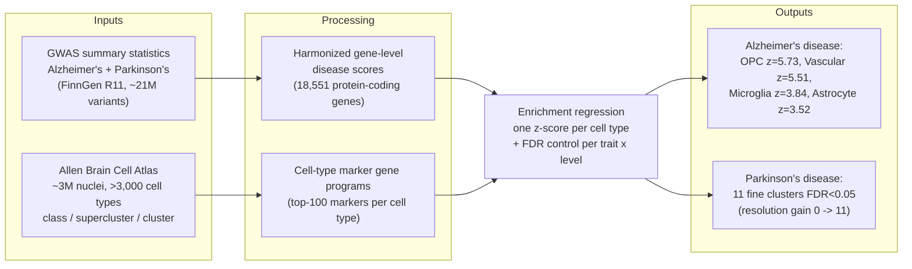

# Concept Figure — Cell-Type-Resolved Heritability Atlas

> **Note.** The rendered concept figure is [`01-concept-schematic.png`](01-concept-schematic.png) in this folder — a generated scientific illustration. This file keeps the Mermaid source of the same diagram so it remains editable and re-renderable.

**Caption:** Concept figure — the pipeline: harmonized GWAS summary statistics and Allen Brain Cell Atlas cell-type marker programs are combined into gene-level disease scores and tested for enrichment, yielding one score per cell type at every level of the cell-type hierarchy.

